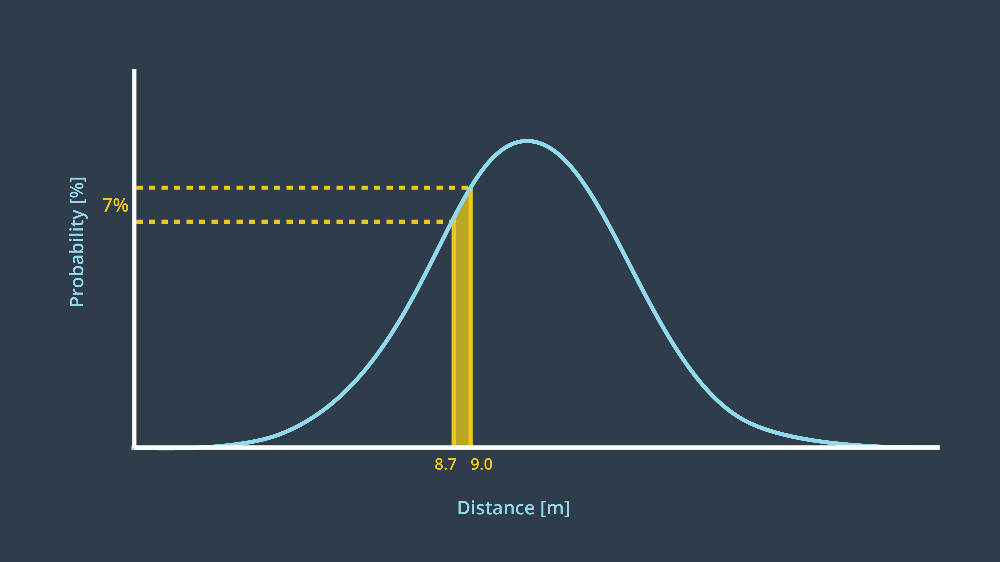
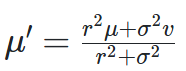
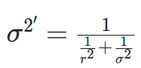
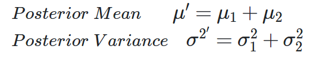
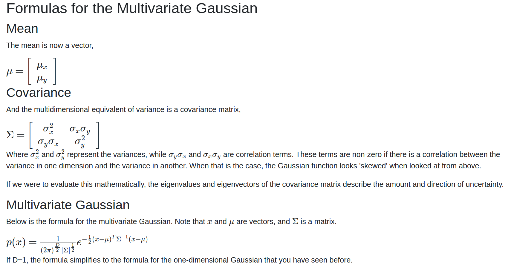

# Robot Localization

There are many algorithms which can help localize out robot in a known map. Please read more [here](http://robots.stanford.edu/papers/thrun.robust-mcl.pdf) for more information about robot localization.

Generally, there are three localization challenges:
- Local Localization / Position Tracking: The robot knows its initial pose and estimate its pose as it moves out on the environment.
- Global Localization: The initial pose of robot is not known, it has to determine its pose relative to the ground truth map.
- Kidnapped Robot: Similar to global localization, but it may appear suddenly at another position on the map.

Moreover, we should consider whether our environment is **static** or **dynamic**. It is clear that localization in a dynamic world will be harder than that of a static world. Here, I will only deal with static environment localization.

Common localization algorithms:
- Monte Carlo Localization
- Extended Kalman Filter
- Multi-Hypothesis Kalman Filter
- Markov Localization
- Grid Localization

Reading Reference:
- http://www.probabilistic-robotics.org/

Here I shall introduce two localization algorithm which is EKF and MCL.  

Comparison


## Kalman Filter

**_Introduction_**
In short, kalman filter is a continuous iteration of a two step process which are measurement update and state prediction. Kalman filter is used to estimate the state of the system with  noisy measurements.

A Gaussian distribution is a probability distribution, which is a continuous function. The probability that a random variable, x, will take a value between x1 and x2 is given by the integral of the function from x1 to x2​. 



To understand more about gaussian / normal distribution watch this [link](https://www.youtube.com/watch?v=hgtMWR3TFnY).

Note that kalman filter treats all noise as unimodal Gaussian. In reality, that’s not the case. However, the algorithm is optimal if the noise is Gaussian. The term optimal expresses that the algorithm minimizes the mean square error of the estimated parameters.

**_1D Kalman Filter_**

Variable naming convention:  
x_t - state at time t  
z_t - measurement at time t  
u_t - control at time t  

Step 1:  
Update measurement, to calculate new mean we can use this formula  and to calculate new variance we can use this formula .  

  

Step 2:  
State prediction, to calculate the state prediction, we use the formula below.  
  

Step 3:  
Loop the process again. With the initial belief, we perform measurement udpate. Follow by, state prediction. Then we start from measurement update again. Use vscode cmake tool extension to run 1DKF and read the code to see how measurement update and state prediction are carried out.  

**_Multivariate Gaussian Kalman Filter_**  

  

## Monte Carlo Localization (MCL)

**_Introduction_**  

MCL is one of the most used localization in the robotics field. It uses particle to represent the belief which has significant advantage over other localization methods. Below are some advantages worth mentioning.

- Particle filters can accommodate (almost) arbitrary sensor characteristics, motion dynamics and noise distributions.
- Particle filters are universal density approximators, weakening the restrictive assumptions on the shape of the posterior density when compared to previous parametric approaches.
- Particle filters focus computational resources in areas that are most relevant, by sampling in proportion to the posterior likelihood.
- By controlling the number of samples online, particle filters can adapt to the available computational resources. The same code can, thus, be executed on computers with vastly different speed without modification.
- Finally, particle filters are surprisingly easy to implement, which makes them an attractive  paradigm for mobile robot localization.

Before moving forward please check out this [video](https://www.youtube.com/watch?v=HZGCoVF3YvM) on Bayes theorem from 3Blue1Brown. It will help you very much on understanding Bayes Filter.

**_pseudo code_**

Previous Belief or Initial Belief -> Motion Update -> Measurement Update -> Resampling -> New Belief

```
Algorithm MCL(previous_belief, actuation_command, sensor_measurements):

    (Initial belief is generated by random particles)
    for m = 1 to M:
        motion_update() // Hypothetical State
        sensor_update() // Weight is computed through sensor measurement
        update_motion_and_measurement_to_previous_state
    end

    for m = 1 to M
        Hight weight particle survive and re-drawn in the next iteration
    end

    return new_belief
```
## Command

g++ main.cpp -std=c++11 -I/usr/include/python2.7 -lpython2.7 -I /usr/local/lib/python2.7/dist-packages/numpy/core/include/

## Reference

**Udacity**  
MCL Github project. [link](https://github.com/udacity/RoboND-MCL-Lab)  

**CMAKE**  
Learning more about cmake. [link](https://www.youtube.com/watch?v=_yFPO1ofyF0&list=PLK6MXr8gasrGmIiSuVQXpfFuE1uPT615s&index=1)  
How to add python2 to cmake. [link](https://cmake.org/cmake/help/v3.16/module/FindPython2.html)  
This is one of the closest to get cmake working but failed becauase he did not include numpy, which is a cmake problem, since the seperate python and numpy package. [link](https://github.com/sychaichangkun/RoboND-MCL-Lab/blob/master/CMakeLists.txt)  
This is recommended by the author which is from his Github repo. [link](https://github.com/lava/matplotlib-cpp/blob/master/contrib/CMakeLists.txt)  
Above are just some links to learn about cmake. Here is the reference that got cmake actually working. Praise the Lord. [link](https://github.com/G-Node/python-neuroshare/blob/master/CMakeLists.txt)  
Although, some changes ought to be done, please reference it to my CMakeLists.txt.  

**Matplotlibcpp**
Matplotlibcpp header file is build during a students diploma thesis