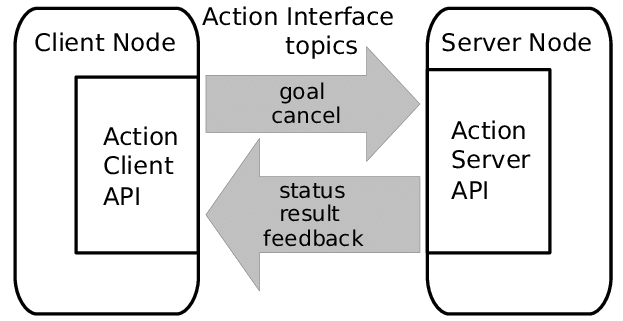

# ROS Basic - Actionlib

This package demonstrate a ROS actionlib. 



## Create your action package

You may wish to run the following command to setup your action with the appropriate dependencies.

`$ catkin_create_pkg actionlib_basic actionlib message_generation roscpp rospy std_msgs actionlib_msgs`

## Create your own action

First, you will have to create a `action` folder in your package to define your action. Create a file ending with `.action`, for example, `Fibonacci.action`.

Inside the file, there will be three section. The first section is where you define your goal msg. The second section is where you define your result msg. Lastly, the third seciton is where you define your feedback msg.

These three sections are divided by the `---` symbol. Checkout the `action` file in this package for more information.

```action
# Goal definition
int32 order
---
# Result definition
int32[] sequence
---
# Feedback
int32[] sequence
```

# CMakeLists.txt + package.xml - Generate your own action

Do the following so that your workspace has the action that you have defined.

1. Create an `action` folder and define your action inside
1. Add dependencies in your `package.xml`
    - Checkout the package's `package.xml` for more information
    ```xml
    <build_depend>message_generation</build_depend>
    <exec_depend>message_runtime</exec_depend> 
    ```
1. Add compile choices in `CMakeLists.txt`
    ```cmake
    # Step 1:
    find_package(catkin REQUIRED COMPONENTS actionlib_msgs)

    # Step 2:
    add_actioin_files(FILES Fibonacci.action)

    # Step 3:
    generate_messages(DEPENDENCIES actionlib_msgs std_msgs  # Or other packages containing msgs)

    # Step 4:
    catkin_package(CATKIN_DEPENDS actionlib_msg)
    ```

# CMakeLists.txt - Compile your code (only for C++ code)

If you create a packages that uses action, add the below lines to compile your code
```cmake
add_executable(actionlib_server src/action_server.cpp)
add_dependencies(actionlib_server ${${PROJECT_NAME}_EXPORTED_TARGETS})
target_link_libraries(actionlib_server ${catkin_LIBRARIES})

add_executable(actionlib_client src/action_client.cpp)
add_dependencies(actionlib_client ${${PROJECT_NAME}_EXPORTED_TARGETS})
target_link_libraries(actionlib_client ${catkin_LIBRARIES})
```