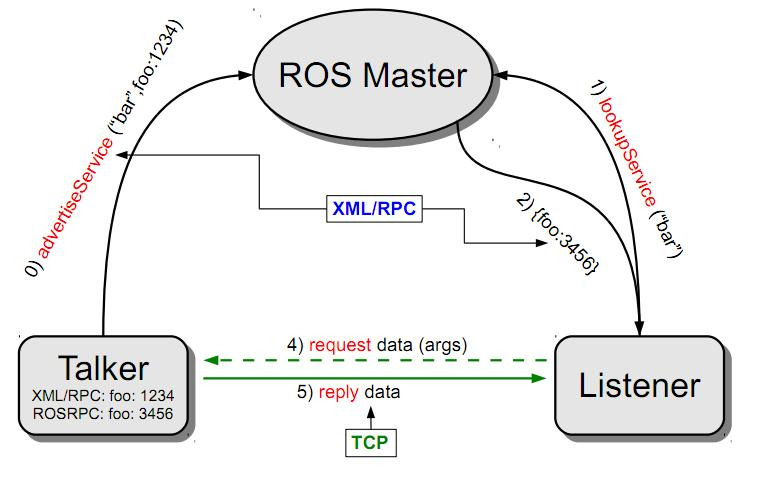

# ROS Basic - Service

This package demonstrate a ROS service. A ROS service is comprise of a server and a client. When the server is ready, clients can send a request. Once the server receive the request, it will return a coresponding responde.

In the `srv` folder is the definition of the service. Since ROS does not know what service you want, you will have to define your own service to be used.



## Creating your own service

First, you will have to create a `srv` folder in your package to define your service. Create a file ending with `.srv`, for example, `AddTwoInts.srv`.

Inside the file there will be two section. The one before `---` is the request section, where the one after `---` is the response section. You will be able to access to the variables you defined through class. See the example below.

```srv
int64 a
int64 b
---
int64 sum
```

# CMakeLists.txt + package.xml - Create your own srv

1. Create a `srv` folder and define your srv inside
1. Add dependencies in your `package.xml`
    - Checkout the package's `package.xml` for more information
    ```xml
    <build_depend>message_generation</build_depend>
    <exec_depend>message_runtime</exec_depend>
    ```
1. Add compile choices in `CMakeLists.txt`
    ```cmake
    # Step 1:
    find_packages(catkin REQUIRED COMPONENTS
      roscpp
      rospy
      std_msg
      genmsg
    )

    # Step 2
    catkin_package(
        CATKIN_DEPENDS
        roscpp
        rospy
        std_msgs
        message_runtime
    )

    # Step 3:
    add_service_file(
        FILES
        AddTwoInts.srv
    )
    generate_message(DEPENDENCIES std_msgs)
    ```

# CMakeLists.txt - Compile your code (only for C++ code)

If you create a packages that uses services, add the below lines to compile your code
```cmake
add_executable(server src/server.cpp)
target_link_libraries(server ${catkin_LIBRARIES})
add_dependencies(server ${PROJECT_NAME}_gencpp)

add_executable(client src/client.cpp)
target_link_libraries(client ${catkin_LIBRARIES})
add_dependencies(client ${PROJECT_NAME}_gencpp)
```

# Conclusion

In this package I tried my best to write the server and client both in C++ and python as similar as possible. However, python is a much easier language to use, the tutorial on ROSWIKI are very different in terms of coding structure. Do note that I use `rospy.loginfo()` instead of `print()` so that the printout msg in the terminal will be the same as the C++ version. [Another thing to keep out is that, if you wnat to use `rospy.info()` to printout msg instead of `print()`, you will have to initialize your node first, which in python, you do not need to initialize a ROS node to call a for a service. So, remember to `rospy.init_node()` before you use and `loginfo()` or `logerr()` method.](http://wiki.ros.org/rospy_tutorials/Tutorials/Logging)