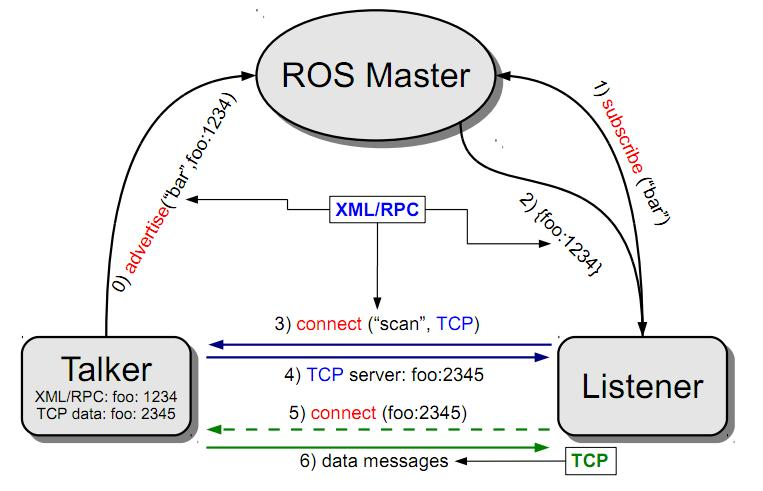

# ROS Basic - Publisher and Subscriber

This package demonstrate ROS publisher and subscriber in both C++ and python. The C++ scripts are in the src `folder` where the python scripts are in the `scripts` folder. Lastly, I also added a new msg in this package called `Person.msg`.



## Build and Run

clone this repo to your catkin_ws, and perform catkin make
```bash
$ cd catkin_ws
$ catkin_make 
```

## C++

To run the talker node with roscore

`$ roslaunch sub_n_pub talker.launch`

Then run the listener node

`$ rosrun sub_n_pub listener`

## Python

Do remember to make the python scripts executable

`$ roscd sub_n_pub/scripts/ && chmod +x *`

Run roscore

`$ roscore`

Run talker_py

`$ rosrun sub_n_pub talker_py.py`

Run listener_py

`$ rosrun sub_n_pub listener_py.py`

## Show my msg (Person.msg)

`$ rosmsg show Person`


# CMakeLists.txt - Compile your code

If you only want to create a publisher and subscriber, add the below lines to compile your code.
```cmake
add_executable(talker src/talker.cpp)
target_link_libraries(talker ${catkin_LIBRARIES})

add_executable(listener src/listener.cpp)
target_link_libraries(listener ${catkin_LIBRARIES})
```

# CMakeLists.txt + package.xml - Create your own msg

1. Create a `msg` folder and define your msg inside
1. Add dependencies in your `package.xml`
    - Checkout the package `package.xml` for more information
    ```xml
    <build_depend>message_generation</build_depend>
    <exec_depend>message_runtime</exec_depend>
    ```
1. Add compile choices in `CMakeLists.txt`
    ```cmake
    # Step 1:
    find_package(catkin REQUIRED COMPONENTS
      roscpp
      rospy
      std_msgs
      genmsg
    )

    # Step 2:
    catkin_package(
    CATKIN_DEPENDS
    roscpp
    rospy
    std_msgs
    message_runtime
    )

    # Step 3:
    add_message_files(FILES Person.msg)
    generate_message(DEPENDENCIES std_msgs)

    ```
